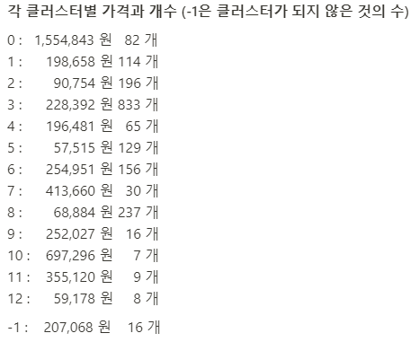

# danawav scrapy project
## 다나와 사이트에서 데이터를 수집후, 그에 맞는 데이터 분석 실시

## 주제
- 다나와 사이트에서 나타나는 `화장대`에 대한 데이터 수집
- 수집한 데이터를 이용해 분석 목적을 가지고 결과 도출

## 목표
수집한 데이터의 정보를 이용해 유사한 상품끼리 묶어 가격을 추정하면 새로운 제품을 추가할 때 `가격을 선제안 해주는 시스템`   
즉, 소비자의 입장이 아닌 `판매자의 편의`를 생각한 시스템을 고려

## 진행과정
- 제품에 대한 **데이터 수집**
    - 제품 `화장대`에 대하여 각 페이지에 해당하는 다양한 데이터를 수집 (**총 19개의 데이터**)
    - `Selenium`과 HPPT의 통신을 이용한 `REQUESTS 패키지`를 이용해 두가지의 버전으로 수집
    - 수집한 데이터를 `mongodb에 적재`후 사용

- 제품을 분석에 용이하게 **데이터 전처리**
    - 리뷰의 수가 상위 5%인 상품에 대하여 `통계분석` 실시
    - 분석에 가능하도록 여러 변수를 수치형으로 변환하거나, 기울기라는 변수를 만드는 것과 같은 전처리를 실시
    - 인턴을 실시한 회사의 토크나이저를 이용하고 이를 벡터화하는 `문자를 수치화하는 과정`을 실시

- 다양한 방식의 **군집분석 분석**
    - Kmeans, DBSCAN, 병합군집을 이용해 `군집분석을 실시`
    - 결측값, 제품의 특성을 이용해 데이터를 조금씩 바꿔가며 다양하게 실시

    - 군집을 위한 `차원축소 기법`으로 PCA를 이용, DBSCAN을 위해 T-SNE기법도 이용

- 분석 결과를 이용한 **결론**
    - Kmeans 기법으로 다양한 방식으로 군집분석을 했을 때 `제대로 분류되지 않는 것`을 보았고, 이 또한 화장대의 특성일 것이라 추측하게 됨
        

    - 하지만, T-SNE기법으로 차원을 축소하고, DBSCAN으로 군집을 했을 때 분류가 됨
        
        

## 이용 데이터
다나와 사이트에서 화장대 검색 후, 전체 상품이 아닌, `가격비교` 제품